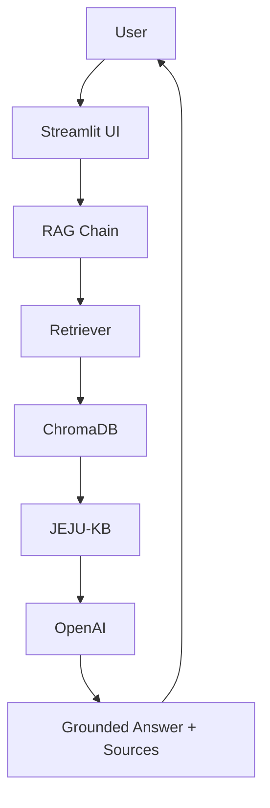

# Meet Local Jeju

**Discover Jeju Beyond Tourism**

A RAG-powered local experience recommendation MVP for Jeju Island, designed to help international travelers discover local stories, food, culture, seasonal living, and authentic island experiences — grounded in a curated, structured knowledge base rather than general model memory.

## Who This Is For

- **International travelers** visiting Jeju who want more than a checklist of attractions.
- **Local experience seekers** looking for authentic culture, food, and seasonal life.
- **People who want to discover Jeju beyond tourist spots** — its stories, its people, its rhythms.

## Portfolio Highlights

- **RAG pipeline** — Markdown knowledge base → chunking → OpenAI embeddings → ChromaDB → retrieval → grounded generation, with each stage its own independently testable module (`rag/loader.py`, `rag/splitter.py`, `rag/vectordb.py`, `rag/retriever.py`).
- **JEJU-KB structured knowledge base** — a 10-category taxonomy with a formal front-matter schema ([KDS](knowledge/KDS.md)) and ID-based cross-linking between documents, not a flat pile of scraped text.
- **Source attribution** — every answer and recommendation is paired with the exact document IDs, titles, categories, and file paths that grounded it.
- **Recommendation mode** — a second, preference-driven interaction mode (`rag/recommender.py`) built on the same retrieval/generation stack as chat, not a bolted-on separate system.
- **Product roadmap toward a trip planner / local experience marketplace** — a documented, honest 6-phase roadmap (see [Long-Term Vision](#long-term-vision)) showing this MVP is a deliberate first step, not a dead end.

## Demo Flow

A quick way to see both modes in action:

- **Chat Mode:** Ask *"Tell me about Jeju stone walls."* — watch it retrieve JEJU-KB context before answering, with sources shown below the answer.
- **Recommendation Mode:** Switch modes in the sidebar, select interests like *culture*, *local people*, and *food*, and submit — get a structured recommendation (Summary, Recommended Local Experiences, Suggested 1-Day Flow, Sources) grounded in the same knowledge base.

Full demo scripts (1-minute and 3-minute versions, plus a step-by-step live sequence): [`docs/product/05_DEMO_SCRIPT.md`](docs/product/05_DEMO_SCRIPT.md).

## Problem → Solution → Product Vision

- **Problem:** Travel AI and guides default to the same popular attractions, and general-purpose chatbots answer Jeju questions from ungrounded memory — neither surfaces what's actually local or seasonal.
- **Solution:** Meet Local Jeju retrieves from JEJU-KB, a curated, source-attributed knowledge base, before generating any answer or recommendation, so every response is traceable, not guessed.
- **Product Vision:** This MVP is Phase 1 of a longer roadmap toward a personalized trip planner and local experience marketplace — still a prototype today, with no booking, payment, or host onboarding.

Full detail: [Problem](#problem) · [Solution](#solution) · [Long-Term Vision](#long-term-vision).

---

## Overview

Most travel AI tools answer Jeju questions from whatever a general-purpose language model happens to remember: the same handful of well-known attractions, repeated in slightly different words. Meet Local Jeju takes a different approach. Every answer is retrieved from **JEJU-KB**, a hand-curated knowledge base of Jeju's local culture, seasonal living, food, festivals, local stories, and daily life — organized, tagged, and versioned like a real data product, not scraped or hallucinated on the fly.

This project helps international travelers discover **authentic local Jeju experiences** — haenyeo diving culture, seasonal tangerine harvests, traditional five-day markets, volcanic stone walls — through **trusted, structured knowledge**, with every answer traceable back to the specific source document that grounded it.

## Problem

International travelers researching Jeju run into three compounding problems:

1. **Homogenized recommendations.** Search engines and travel apps converge on the same "top 10" attractions, driven by SEO and social virality rather than authenticity.
2. **Fragmented local knowledge.** Jeju's richest cultural and seasonal knowledge exists, but scattered across Korean-language sources, rarely consolidated or translated.
3. **No trustworthy filter for "authentic."** Existing tools optimize for popularity, not cultural depth or seasonal relevance — and general-purpose AI chatbots will confidently answer from memory even when that memory is thin, generic, or wrong.

## Solution

Meet Local Jeju is a conversational assistant that answers **only** from a curated knowledge base, not from whatever a language model happens to recall about Jeju:

1. A traveler asks a question in plain English.
2. The system retrieves the most relevant chunks from **JEJU-KB** — never the model's general training knowledge.
3. An LLM synthesizes an answer **strictly from that retrieved context**, citing the source document title and ID inline.
4. The full source list (with category, chunk ID, and file path) is shown alongside the answer, so the traveler can see exactly where the information came from.

If JEJU-KB doesn't have relevant information for a question, the assistant says so — it does not fill the gap with invented specifics.

## Long-Term Vision

Meet Local Jeju starts as a RAG-powered local knowledge assistant — that's the entire product today. But the long-term goal is bigger: to become a **trusted local experience and trip-planning platform** that connects international travelers with authentic Jeju local life, not just answers about it.

This MVP is **Phase 1** of a longer product roadmap:

| Phase | Direction | Status |
|---|---|---|
| 1 | RAG-powered local knowledge assistant | ✅ **Current MVP (this repo)** |
| 2 | Personalized experience recommendation mode | 🔜 Planned |
| 3 | Multi-day trip planner | 🔭 Future |
| 4 | Local host and experience dataset | 🔭 Future |
| 5 | Marketplace prototype with mock booking flow | 🔭 Future |
| 6 | Real platform — host onboarding, booking, reviews, payments, partnerships | 🔭 Long-term vision |

The future platform direction (Phases 2–6) includes a personalized trip planner, a local experience marketplace, host profiles for farmers, haenyeo culture guides, market guides, artisans, and local storytellers, stay + experience packages, and — long term — Airbnb-like booking and reviews. **None of that exists yet.** No host onboarding, booking flow, payments, user accounts, or reviews are implemented in this codebase.

> This MVP focuses on the knowledge and recommendation layer first. Before building booking, payment, or host-management features, the project validates whether AI can understand traveler intent and match it with structured local knowledge.

Meet Local Jeju is not trying to recommend famous tourist spots — that's what separates it from generic travel guide apps (popularity-ranked, not authenticity-ranked), generic AI chatbots (ungrounded, unattributed answers from memory), Airbnb (booking infrastructure first, discovery second), and traditional tour platforms (fixed, commission-driven packages). It's designed to help travelers discover local stories, seasonal living, people, food, culture, and authentic island experiences — with the marketplace layer only introduced later, once that foundation is proven.

Full detail on the platform direction, phase-by-phase scope, and an explicit "what exists vs. what doesn't" table: [`docs/product/01_PRODUCT_BRIEF.md`](docs/product/01_PRODUCT_BRIEF.md).

## Why RAG?

A general-purpose LLM asked "what's an authentic thing to do in Jeju in October?" will answer from broad training data — plausible-sounding, but not grounded in anything specific, current, or verifiable. Retrieval-Augmented Generation solves this differently:

- **Groundedness over fluency.** The model is instructed to answer only from retrieved JEJU-KB chunks, not its own memory of Jeju.
- **Updatable without retraining.** New knowledge documents can be added to `knowledge/` and re-embedded at any time — no model fine-tuning required.
- **Traceable answers.** Every claim can be traced back to a specific document ID and file path, which is what makes "authentic" a verifiable property instead of a marketing word.
- **Honest uncertainty.** The system prompt explicitly instructs the model to say when JEJU-KB doesn't cover something, rather than inventing prices, schedules, addresses, or named individuals to fill the gap.

## Key Features

- **Pinterest-style "Featured Local Ideas" board** — six browsable local experience cards (category chip, description, "Save idea - prototype only" badge) as a visual entry point before a traveler even asks a question. See [Design Direction](#design-direction).
- **Two modes, one sidebar toggle** — conversational Q&A ("Ask Local Jeju AI") and preference-based recommendations ("Get Experience Recommendations"), both grounded in the same JEJU-KB.
- **Conversational chat UI** (Streamlit) with persistent session history.
- **Retrieval-grounded answers** — every response is generated from retrieved JEJU-KB chunks, never from unaided model memory.
- **Source attribution** — each answer is paired with the exact source documents (title, category, chunk ID, file path) that grounded it.
- **Structured knowledge base (JEJU-KB)** — Markdown + YAML front matter documents organized into 10 topical categories with a formal schema (see [Knowledge Document Standard](#knowledge-document-standard-kds)).
- **Seasonal and category-aware content** — knowledge documents carry `season`, `region`, and `category` metadata for more precise retrieval.
- **Guardrails against fabrication** — the prompt explicitly forbids inventing exact prices, schedules, addresses, phone numbers, or named individuals.
- **Example questions in the sidebar** for instant, one-click demoing.

## Experience Recommendation Mode

Alongside chat, the sidebar has a **"Get Experience Recommendations"** mode — a short preference form that turns a traveler's stated interests into a structured, grounded recommendation, instead of a free-form Q&A answer.

**This is a recommendation feature, not a booking or marketplace feature.** It doesn't check availability, show prices, or let anyone reserve anything — see [Long-Term Vision](#long-term-vision) for where this fits in the broader roadmap.

**Form fields:** travel interests (food, culture, nature, local people, farming, ocean, markets, slow travel), travel style (relaxing, active, cultural, family-friendly, solo traveler, budget-friendly), season or month (optional), transportation (car, no car, public transportation, taxi, walking), preferred area (optional), and an optional free-text note.

**How it works:** the form's answers are converted into a natural-language query (`rag/recommender.py: build_recommendation_query`), which retrieves relevant JEJU-KB chunks via the same retriever used by chat mode (`rag.retriever.retrieve_relevant_documents`), then a chat model (same model, same groundedness rules as chat mode) generates a structured recommendation:

1. **Summary** — a short read on what fits this traveler.
2. **Recommended Local Experiences** — up to 3, each with why it fits, what local story/culture it connects to, and a practical note *only if JEJU-KB actually supports one*.
3. **Suggested 1-Day Flow** — a simple sequencing of the recommended experiences, only if the context supports combining them.
4. **Sources** — same structured source list (id, title, category, chunk ID, file path) shown in chat mode.

## Design Direction

The UI direction is **Pinterest-inspired local discovery**, layered on top of the same two functional modes above — not a redesign of what the app does, but of how it invites a traveler in before they've typed anything.

Concretely, that means:

- **Pinterest-style discovery board** — the "Featured Local Ideas" section on the home screen: six browsable cards, no search box required, meant for skimming before committing to a question or a form.
- **Airbnb-style experience cards** — each idea card carries a category chip, a short description, and a "Save idea - prototype only" badge, echoing the visual grammar of an experience listing without implementing any of the backend behind one.
- **AI travel concierge** — chat mode and recommendation mode remain the functional core; the discovery board is a warmer front door to them, not a replacement.

**This is still a Streamlit portfolio MVP, not a production mobile app.** The card grid, chips, and "save" badges are static, developer-authored content styled with custom CSS inside Streamlit — there is no image pipeline, no persistence layer behind "Save idea," and no native app. See [What This MVP Does Not Do Yet](#current-limitations) for the full list of what's intentionally not implemented.

## Demo Questions

Try these in the running app — all four are verified end-to-end against the current knowledge base:

- *"I want to learn about haenyeo culture."*
- *"What can I do in Jeju in October?"*
- *"I want to meet local people at a traditional market."*
- *"Tell me about Jeju stone walls."*

## Architecture



This diagram shows the query-time path a question takes through the system. `JEJU-KB → ChromaDB` is populated ahead of time by a separate **offline ingestion pipeline** (`rag/loader.py` → `rag/splitter.py` → `rag/vectordb.py`), not on every query — the vector store is built once via `python3 rag/vectordb.py` and simply *read* at query time. See [`docs/product/02_ARCHITECTURE.md`](docs/product/02_ARCHITECTURE.md) for the full system architecture, including the ingestion-phase diagram and the ChromaDB collection design.

## Project Structure

```
meet-local-jeju/
├── app.py                     # Streamlit UI — chat mode + recommendation mode
│
├── knowledge/                  # JEJU-KB — the AI knowledge base (RAG source of truth)
│   ├── KDS.md                    # Knowledge Document Standard
│   ├── README.md                 # What JEJU-KB is, why it's separate from docs/
│   ├── stories/                  # 2 knowledge objects (STORY-0001, STORY-0002)
│   ├── experiences/              # 3 knowledge objects (EXP-0001 – EXP-0003)
│   ├── local_life/               # 2 knowledge objects (LOCAL-0001, LOCAL-0002)
│   ├── seasonal_living/          # 1 knowledge object (SEASON-0001)
│   ├── food/                     # 1 knowledge object (FOOD-0001)
│   ├── culture/                  # 1 knowledge object (CULTURE-0001)
│   ├── festivals/                # folder + README only — not yet populated
│   ├── government/               # folder + README only — not yet populated
│   ├── transportation/           # folder + README only — not yet populated
│   └── tourism/                  # folder + README only — not yet populated
│
├── rag/                        # RAG pipeline
│   ├── loader.py                 # Parses knowledge/*.md into LangChain Documents
│   ├── splitter.py               # Chunks documents (chunk_size=800, overlap=120)
│   ├── vectordb.py               # OpenAI embeddings + ChromaDB build/load
│   ├── retriever.py              # Query-time similarity search
│   ├── chain.py                  # Grounded-answer prompt + generation (chat mode)
│   ├── recommender.py            # Preference-based grounded recommendations (recommendation mode)
│   └── embeddings.py             # Placeholder — not yet implemented (see Limitations)
│
├── data/                       # Working storage for the ingestion pipeline (raw/processed/embeddings)
├── vector_db/chroma/            # Persisted ChromaDB collection (build artifact, gitignored)
│
├── docs/                       # Product documentation
│   ├── 01_PRD.md                 # Product Requirement Document
│   └── product/
│       ├── 01_PRODUCT_BRIEF.md     # Long-term platform vision
│       ├── 02_ARCHITECTURE.md      # System architecture
│       └── 05_DEMO_SCRIPT.md       # Live demo walkthrough
│
├── utils/
│   ├── ui_helpers.py              # Streamlit rendering helpers — cards, hero, sources (no RAG logic)
│   └── config.py, helpers.py     # Placeholders — not yet implemented
├── pages/                      # Additional Streamlit pages (none yet)
│
├── requirements.txt
├── .env.example
└── .gitignore
```

## JEJU-KB Knowledge Base

JEJU-KB is the curated knowledge base that grounds every answer — it is deliberately kept separate from `docs/` (product documentation for the team) because it has a different audience (the retrieval pipeline and, indirectly, end users), a different lifecycle (grows continuously as content is curated), and a different trust bar (every fact needs to be attributable). See [`knowledge/README.md`](knowledge/README.md) for the full rationale.

JEJU-KB is organized into **10 topical categories**:

| Category | Populated? |
|---|---|
| `stories` | ✅ 2 documents |
| `experiences` | ✅ 3 documents |
| `local_life` | ✅ 2 documents |
| `seasonal_living` | ✅ 1 document |
| `food` | ✅ 1 document |
| `culture` | ✅ 1 document |
| `festivals` | Not yet populated |
| `government` | Not yet populated |
| `transportation` | Not yet populated |
| `tourism` | Not yet populated |

**10 knowledge objects currently populated**, cross-linked by ID (e.g. the haenyeo story `STORY-0001` links to the haenyeo culture walk `EXP-0002`), forming a small but real knowledge graph rather than a flat document pile.

## Knowledge Document Standard (KDS)

Every JEJU-KB document is Markdown with YAML front matter, following the formal spec in [`knowledge/KDS.md`](knowledge/KDS.md) — not raw PDFs, because front matter can't live inside a PDF, and PDF text extraction degrades chunk quality.

**Required front matter fields:** `id`, `title`, `category`, `subcategory`, `island`, `region`, `season`, `tags`, `language`, `source`, `last_updated`.

**Optional fields:** `related_experiences`, `related_food`, `related_stories`, `transportation`, `difficulty`, `duration`, `target_user`.

**ID convention:** `{PREFIX}-{NNNN}`, one prefix per category (`STORY-0001`, `EXP-0001`, `LOCAL-0001`, `SEASON-0001`, `FOOD-0001`, `CULTURE-0001`, plus `FEST`, `GOV`, `TRANS`, `TOUR` reserved for the remaining categories). IDs are immutable once assigned and are what the loader validates against before a document can be ingested.

This schema is what makes category-aware, season-aware, metadata-filtered retrieval possible — and what lets `rag/loader.py` validate every document at load time and raise a clear error (file path + missing fields) rather than silently ingesting incomplete content.

## Tech Stack

| Layer | Technology |
|---|---|
| Language | Python |
| UI | Streamlit |
| Orchestration | LangChain (`langchain`, `langchain-community`, `langchain-openai`, `langchain-chroma`) |
| Vector store | ChromaDB (persisted locally at `vector_db/chroma/`) |
| Embeddings | OpenAI `text-embedding-3-small` |
| Generation | OpenAI `gpt-4o-mini` |
| Config | `python-dotenv` |
| Front matter parsing | PyYAML |

## How to Run Locally

```bash
# 1. Install dependencies
pip install -r requirements.txt

# 2. Create your environment file
cp .env.example .env
# then edit .env and set OPENAI_API_KEY=...

# 3. Build the vector store (one-time, or whenever knowledge/ changes)
python3 rag/vectordb.py

# 4. Run the app
streamlit run app.py
```

Step 3 embeds every JEJU-KB document and persists them to `vector_db/chroma/`. The Streamlit app **only reads** from that persisted store — it never rebuilds the vector database itself, so step 3 must be run at least once before the app can answer questions.

## Environment Variables

| Variable | Required | Description |
|---|---|---|
| `OPENAI_API_KEY` | Yes | Your OpenAI API key, used for both embeddings and chat generation. Set it in a local `.env` file (see `.env.example`) — never commit a real key. `.env` is gitignored. |

## Example Output

**Question:** *"Tell me about Jeju stone walls."*

> Jeju's stone walls, known as batdam, are low, dry-stacked walls made from black volcanic basalt. These walls are constructed without mortar and are designed to withstand the island's persistent coastal winds. Their unique construction allows wind to pass through the gaps, preventing the walls from being pushed over. Batdam mark the boundaries of small, irregularly shaped agricultural plots, reflecting the island's volcanic terrain rather than a grid-like layout common elsewhere.
>
> These stone walls are not merely decorative; they play a functional role in Jeju's traditional agricultural practices. The system of fields organized around batdam has been recognized as a Globally Important Agricultural Heritage System by the FAO, highlighting its significance as a long-standing and still-functioning land-management practice.
>
> Travelers can find batdam throughout Jeju's mid-mountain farmland, especially around citrus orchards and in coastal fishing villages ("Batdam: The Black Stone Walls of Jeju", CULTURE-0001).

**Sources (4):**

| ID | Title | Category | Chunk | File |
|---|---|---|---|---|
| CULTURE-0001 | Batdam: The Black Stone Walls of Jeju | culture | CULTURE-0001::chunk-0 | `knowledge/culture/CULTURE-0001-jeju-stone-walls.md` |
| CULTURE-0001 | Batdam: The Black Stone Walls of Jeju | culture | CULTURE-0001::chunk-1 | `knowledge/culture/CULTURE-0001-jeju-stone-walls.md` |
| CULTURE-0001 | Batdam: The Black Stone Walls of Jeju | culture | CULTURE-0001::chunk-2 | `knowledge/culture/CULTURE-0001-jeju-stone-walls.md` |
| CULTURE-0001 | Batdam: The Black Stone Walls of Jeju | culture | CULTURE-0001::chunk-3 | `knowledge/culture/CULTURE-0001-jeju-stone-walls.md` |

**Recommendation mode example** — interests: *culture, local people, food*; style: *solo traveler, cultural*; season: *October*; area: *Seogwipo*:

> **Summary**
> For a solo traveler interested in culture, local people, and food in Seogwipo during October, there are several authentic experiences that allow for interaction with the local community and exploration of Jeju's agricultural and culinary traditions.
>
> **Recommended Local Experiences**
> - **Guided Visit to a Jeju Five-Day Market** — aligns with meeting local people and exploring local cuisine through vendor interaction and sampling traditional foods.
> - **Haenyeo Culture Walk: Coastal Path and Community Museum** — an intimate look at haenyeo (women divers) culture and their connection to the sea.
> - **October in the Orchards: The Start of Jeju's Tangerine Season** — orchard walks and autumn colors around Seogwipo, with the chance to engage with local farmers.
>
> **Suggested 1-Day Flow**
> Market visit in the morning → Haenyeo Culture Walk along the coast → an afternoon stroll through the orchards.
>
> **Sources**
> Guided Visit to a Jeju Five-Day Market (EXP-0003) · Haenyeo Culture Walk (EXP-0002) · October in the Orchards (SEASON-0001)

## Current Limitations

- **Knowledge coverage is partial.** 10 documents across 6 of 10 categories — `festivals`, `government`, `transportation`, and `tourism` have folder scaffolding but no content yet.
- **English only.** No multi-language ingestion or querying yet.
- **Single-turn retrieval.** Each question is answered independently; prior conversation turns are displayed in the UI but are not yet used as retrieval context for follow-up questions.
- **Recommendation mode is a recommendation, not a plan or a marketplace.** It suggests at most 3 experiences and a possible 1-day sequencing — it does not build multi-day itineraries, does not know real-time availability, and has no host, booking, or payment layer behind it (see [Long-Term Vision](#long-term-vision) for where that would fit later).
- **The "Featured Local Ideas" board is static, developer-authored content.** The six cards are hard-coded, not generated per-user, and "Save idea - prototype only" is a non-interactive label — nothing is actually saved anywhere.
- **`utils/ui_helpers.py` uses custom CSS (`unsafe_allow_html=True`) for card styling.** All content rendered through it is static and developer-authored — no user input is ever passed into the HTML, so this is a styling choice, not a user-generated-content risk.
- **Full rebuild only.** `build_vector_store()` always rebuilds the entire collection from scratch — there's no incremental/partial re-ingestion yet.
- **Some source content is illustrative.** A few narrative "story" documents are composite accounts written to demonstrate the format, explicitly flagged as such in their own `Source Notes` sections, pending real attributed sourcing.
- **`rag/embeddings.py`, `utils/config.py`, and `utils/helpers.py` are still placeholders.** Embedding configuration currently lives directly in `rag/vectordb.py` rather than a shared config module.
- **No reservation, payment, login, host onboarding, or admin features.** Intentionally out of scope for Phase 1 — these belong to later phases of the platform vision (see [Long-Term Vision](#long-term-vision) and [`docs/product/01_PRODUCT_BRIEF.md`](docs/product/01_PRODUCT_BRIEF.md)), not this MVP.

## Future Roadmap

This section covers near-term improvements *within Phase 1* (the current RAG assistant). For the larger 6-phase platform vision — trip planning, a local experience marketplace, host profiles, and eventually Airbnb-like booking — see [Long-Term Vision](#long-term-vision) above and the full [Product Brief](docs/product/01_PRODUCT_BRIEF.md).

- Populate the remaining four JEJU-KB categories (`festivals`, `government`, `transportation`, `tourism`).
- Multi-language support (Korean, Japanese, Chinese).
- Multi-turn, context-aware follow-up questions.
- A community/curator content contribution pipeline with review gating.
- Partnerships with Jeju public tourism and cultural heritage sources for verified content feeds.
- An evaluation harness to systematically track groundedness and hallucination rate over time.
- Extending the same knowledge-base + RAG pattern to other regions beyond Jeju.

See [`docs/01_PRD.md`](docs/01_PRD.md) for the full Phase 1 product requirements and non-goals.

## What I Learned

Building this project end-to-end — from a bare project skeleton through a working, source-attributed RAG assistant — surfaced a few lessons worth calling out:

- **Metadata design is the real product.** The hardest and most valuable part of this project wasn't the retrieval code — it was designing a knowledge document standard (KDS) with a consistent schema, ID scheme, and category taxonomy *before* writing any content. Once that existed, loading, chunking, and retrieval all became mechanical.
- **Type mismatches hide in "boring" layers.** PyYAML silently parses unquoted `YYYY-MM-DD` front matter values into Python `date` objects instead of strings — which loaded and chunked without any error, then broke ChromaDB ingestion with a cryptic metadata-type error. The fix belonged in the loader (normalize types at the source), not patched around downstream.
- **Grounding has to be enforced at the prompt level, not assumed.** Retrieval alone doesn't stop a model from padding an answer with plausible-sounding specifics. The system prompt explicitly forbids inventing prices, schedules, addresses, and named individuals — and it's testable: every demo answer was checked against that constraint.
- **Separating "knowledge" from "docs" pays off immediately.** Keeping product documentation (`docs/`) and AI-facing knowledge (`knowledge/`) in separate trees with different quality bars made it obvious, at every step, what was safe to feed into the ingestion pipeline and what wasn't.
- **A CLI test block per module is worth the extra few lines.** Every `rag/` module (`loader.py`, `splitter.py`, `vectordb.py`, `retriever.py`, `chain.py`) is independently runnable and verifiable via `python3 rag/<module>.py`, which made debugging the pipeline stage-by-stage far faster than only testing through the UI.
