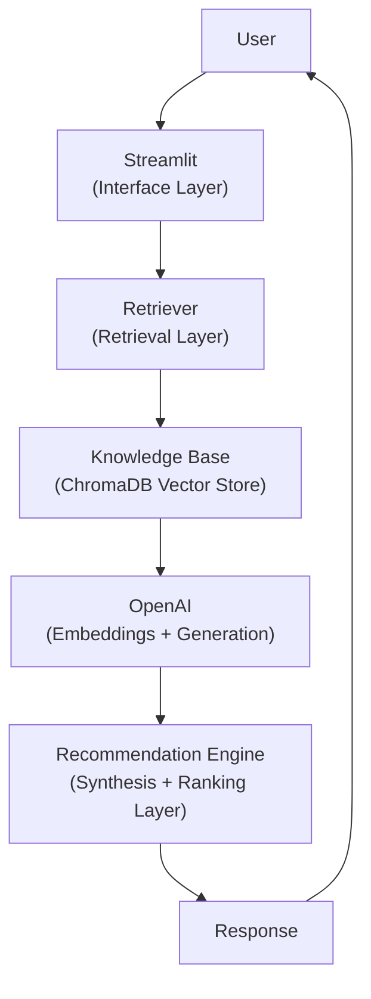
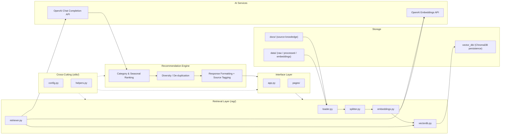
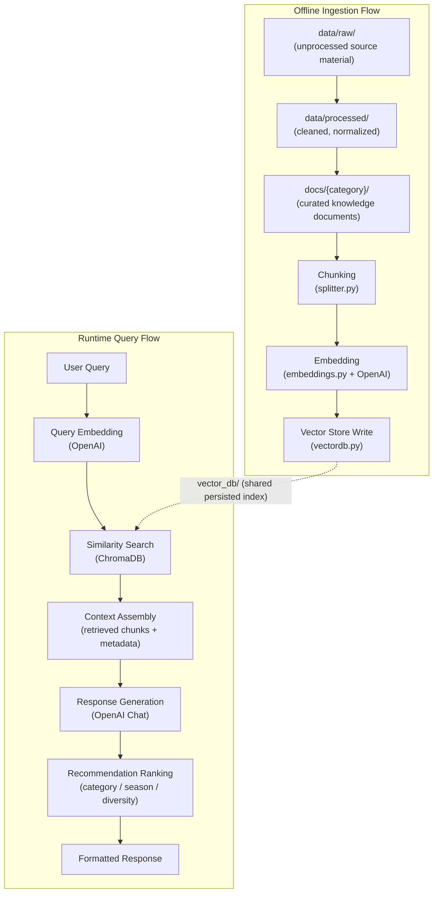
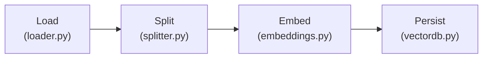
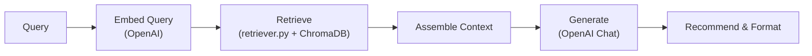
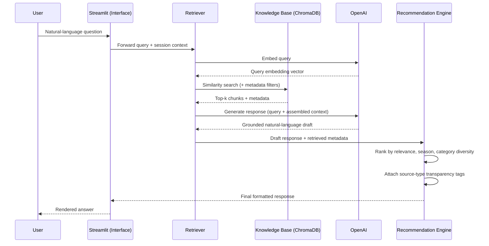
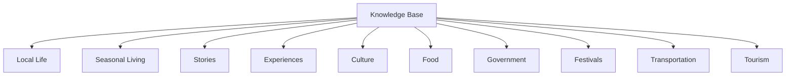
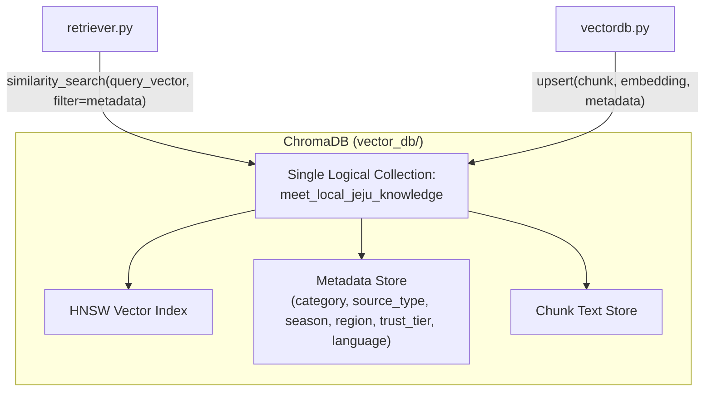
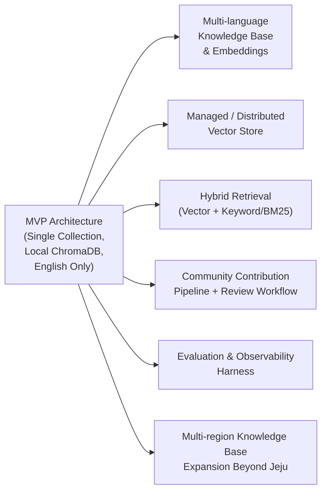

# Meet Local Jeju — System Architecture

**Document Owner:** Engineering
**Status:** Draft v1.0
**Audience:** Senior Engineers, AI Architects
**Related:** [`01_PRD.md`](../01_PRD.md)

---

## 1. High-Level System Architecture

Meet Local Jeju is a Retrieval-Augmented Generation (RAG) system with a single-turn-extensible conversational interface. The system is deliberately layered so that retrieval quality, generation quality, and recommendation quality can each be reasoned about and improved independently.

At the highest level, a user request moves through a linear pipeline: the interface layer collects intent, the retrieval layer grounds that intent in curated knowledge, the generation layer synthesizes language, and a recommendation layer converts that language into structured, trustworthy suggestions before it is returned to the user.



**Design principle:** each arrow in this chain is a module boundary, not just a data hop. The Retriever does not know how the LLM will phrase an answer; the Recommendation Engine does not know how documents were embedded. This isolation is what allows the RAG pipeline, the knowledge base taxonomy, and the generation strategy to evolve independently as the product matures.

## 2. Component Diagram

The system is composed of six logical components. Four map directly to code modules already scaffolded in the repository (`rag/`, `utils/`); two (Recommendation Engine, Interface Layer) are architectural roles that compose existing and future modules.



**Component responsibilities:**

| Component | Responsibility | Owns |
|---|---|---|
| Interface Layer | Collects user input, renders responses, manages session/UI state | `app.py`, `pages/` |
| Retrieval Layer | Loads, chunks, embeds, indexes, and retrieves knowledge base content | `rag/*.py` |
| Storage | Persists source documents, intermediate data, and vector embeddings | `docs/`, `data/`, `vector_db/` |
| AI Services | Provides embedding and language generation capability | OpenAI API (external) |
| Recommendation Engine | Converts grounded LLM output into ranked, diverse, source-tagged recommendations | Logical layer, composed within `rag/` and/or a future `recommend.py` |
| Cross-Cutting Config | Centralizes settings and shared utilities used by all layers | `utils/*.py` |

## 3. Data Flow Diagram

Two distinct data flows exist in the system: an **offline ingestion flow** (batch, infrequent, write path into the Knowledge Base) and a **runtime query flow** (online, per-request, read path out of the Knowledge Base). Separating these is central to keeping query latency low and knowledge base updates independent of application deployment.



**Key property:** the ingestion flow and query flow only interact through the persisted vector store. This means the knowledge base can be re-ingested, expanded, or corrected at any time without redeploying the application, and query-time behavior can be changed (ranking, prompting) without re-running ingestion.

## 4. RAG Pipeline

The RAG pipeline is the technical core of the product and is split into two phases, each composed of single-responsibility stages.

### 4.1 Ingestion Phase (build-time / scheduled)



- **Load** — reads source material from `docs/{category}/` and `data/raw/`, normalizing into a common document representation with category, source, and (where applicable) seasonal metadata attached.
- **Split** — chunks documents into retrieval-sized units. Chunking strategy is content-aware: narrative cultural/story content favors semantic or paragraph-based splitting; structured content (festival dates, government notices) favors smaller, fact-dense chunks.
- **Embed** — generates vector embeddings via the OpenAI Embeddings API. Embeddings are cached in `data/embeddings/` to avoid redundant API cost on re-ingestion of unchanged content.
- **Persist** — writes chunks, embeddings, and metadata into the ChromaDB collection(s) backing `vector_db/`.

### 4.2 Retrieval & Generation Phase (runtime, per query)



- **Query** — raw natural-language input from the user.
- **Embed Query** — the same embedding model used at ingestion time is used at query time, ensuring embedding-space consistency.
- **Retrieve** — top-k similarity search against ChromaDB, optionally constrained by metadata filters (category, season) derived from lightweight query classification.
- **Assemble Context** — retrieved chunks and their metadata are composed into a grounding context, respecting a token budget.
- **Generate** — the LLM synthesizes a natural-language answer strictly from the assembled context, following a system prompt that prioritizes groundedness over completeness.
- **Recommend & Format** — the Recommendation Engine ranks and diversifies suggestions across categories, attaches source-type transparency, and formats the final response for the Interface Layer.

## 5. Folder Architecture

The physical repository structure mirrors the logical pipeline described above, so that any engineer can locate the code or data responsible for a given stage without cross-referencing documentation.

```
meet-local-jeju/
├── app.py                     # Streamlit entry point (Interface Layer)
├── pages/                     # Additional Streamlit views
│
├── docs/                      # Curated knowledge base source (ingested)
│   ├── product/                # Product & architecture documentation (this file)
│   ├── local_life/
│   ├── seasonal_living/
│   ├── stories/
│   ├── experiences/
│   ├── culture/
│   ├── food/
│   ├── government/
│   ├── festivals/
│   ├── transportation/
│   └── tourism/
│
├── data/                      # Working data storage for the ingestion pipeline
│   ├── raw/                    # Unprocessed source material
│   ├── processed/              # Cleaned, normalized content pre-chunking
│   └── embeddings/             # Cached embedding vectors
│
├── vector_db/                 # Persisted ChromaDB index (build artifact, not source)
│
├── rag/                       # RAG pipeline modules
│   ├── loader.py                # Ingestion: source → common document format
│   ├── splitter.py              # Ingestion: document → retrieval-sized chunks
│   ├── embeddings.py            # Shared embedding model configuration
│   ├── vectordb.py              # ChromaDB client / collection management
│   └── retriever.py             # Query-time retrieval logic
│
├── utils/                     # Cross-cutting concerns
│   ├── config.py                # Centralized settings (env vars, model names, top-k, etc.)
│   └── helpers.py               # Generic shared utilities
│
├── requirements.txt
├── .env.example
└── .gitignore
```

**Architectural rule:** `docs/` and `data/raw/` are the only writable-by-humans, source-of-truth locations. `data/processed/`, `data/embeddings/`, and `vector_db/` are all *derived* artifacts, fully reproducible from `docs/` and `data/raw/` by re-running the ingestion phase. No engineer should hand-edit anything under `vector_db/`.

## 6. AI Workflow

The AI workflow describes the precise sequence of calls made to external AI services for a single user request, including where embedding and generation calls are made relative to retrieval.



**Note on the requested top-level flow** (`User → Streamlit → Retriever → Knowledge Base → OpenAI → Recommendation Engine → Response`): the query-embedding call to OpenAI occurs *inside* the Retriever step, prior to the Knowledge Base lookup, and is intentionally omitted from the high-level diagram in Section 1 to keep the primary narrative uncluttered. The sequence diagram above is the authoritative, complete call order.

**Prompting principle:** the system prompt sent to OpenAI at generation time instructs the model to answer only using the assembled context, to explicitly acknowledge when the knowledge base has limited coverage of a topic, and to avoid fabricating specific facts (dates, prices, exact locations) not present in retrieved chunks. This is enforced at the prompt level and validated at the evaluation level (see Section 9).

## 7. Knowledge Base Architecture

The Knowledge Base is the product's core asset and primary differentiator from a generic LLM wrapper. It is organized as a flat set of ten top-level categories, each independently curated, versioned, and ingestible, with cross-category retrieval enabled through shared metadata rather than rigid hierarchy.



**Category definitions:**

| Category | Scope |
|---|---|
| **Local Life** | Everyday rhythms of living on Jeju — how locals shop, commute, socialize, and spend ordinary time; the connective tissue between the other categories. |
| **Seasonal Living** | Seasonal farming cycles, harvest periods, seasonal natural phenomena (e.g., cherry blossoms, canola fields, camellias), and time-of-year-specific local behavior. |
| **Stories** | Oral history, local legends, community-sourced narratives, and personal accounts that convey lived experience beyond official records. |
| **Experiences** | Concrete, describable activities a traveler can engage in that are locally authentic (distinct from generic "attractions"). |
| **Culture** | Jeju traditions, dialect, haenyeo heritage, shamanic and folk practices, customs, and etiquette. |
| **Food** | Local cuisine, seasonal ingredients, traditional dishes, markets, and dining customs. |
| **Government** | Official/public information from trusted government and municipal sources — safety, regulation, public facilities. |
| **Festivals** | Seasonal and community festivals, ceremonies, and their cultural significance and timing. |
| **Transportation** | Practical local mobility knowledge — public transit patterns and authentic ways of getting around the island. |
| **Tourism** | General points of interest, retained for context and to allow the system to contrast mainstream attractions against authentic alternatives. |

### 7.1 Metadata Schema

Every ingested chunk carries a consistent metadata envelope, independent of its category, enabling cross-cutting retrieval strategies (seasonal filtering, source-trust weighting, diversity ranking) without per-category special-casing:

| Field | Purpose |
|---|---|
| `category` | One of the ten top-level categories above; primary retrieval filter. |
| `source_type` | e.g., `government`, `community`, `editorial`, `oral_history` — drives source-transparency labeling. |
| `season` (optional) | Applicable time-of-year, when relevant (e.g., festivals, farming). |
| `region` (optional) | Sub-island geographic tagging, for future location-aware retrieval. |
| `trust_tier` | Curation confidence level, used to weight ranking and to gate what can be stated as fact vs. as anecdote. |
| `language` | Source content language, in preparation for multi-language ingestion. |
| `ingested_at` | Timestamp for freshness tracking and re-ingestion auditing. |

### 7.2 Curation Principle

Unlike Tourism, which can tolerate broader/looser sourcing, categories like Culture, Government, and Food are held to a stricter `trust_tier` bar before ingestion, since these are the categories most exposed to hallucination risk and cultural-sensitivity risk if source quality is low. Curation review is a required step before any document enters `docs/`, not an afterthought applied post-ingestion.

## 8. ChromaDB Architecture



**Design decisions:**

- **Single collection, rich metadata** — rather than one ChromaDB collection per category, the MVP uses a single collection (`meet_local_jeju_knowledge`) with `category` as an indexed metadata field. This preserves the ability to run cross-category semantic search (a query about "seasonal food festivals" legitimately spans Food, Festivals, and Seasonal Living) while still supporting category-scoped filtering when a query is unambiguous.
- **Local persistence** — ChromaDB runs in persistent local mode, backed by the `vector_db/` directory. This is appropriate for MVP scale and keeps infrastructure minimal; it is explicitly identified as a future scaling constraint (Section 9).
- **Upsert-based updates** — re-ingesting a document updates its existing vector/metadata entry rather than duplicating it, keyed by a stable document/chunk identifier derived from source path and chunk index. This allows the knowledge base to be corrected or refreshed idempotently.
- **Metadata-first filtering** — category, season, and trust_tier filters are applied at the ChromaDB query level (pre-filtering), not post-retrieval in application code, to keep retrieval both fast and precise as the collection grows.

## 9. Future Scalability

The MVP architecture is intentionally minimal but is designed so that each of the following extensions is additive, not a rewrite.



- **Multi-language knowledge base and embeddings** — the metadata schema already reserves a `language` field. Scaling to Korean, Japanese, and Chinese source content and multilingual query support requires adding language-aware embedding handling and, likely, per-language retrieval scoping — not a schema change.
- **Managed or distributed vector store** — local ChromaDB persistence is sufficient for MVP document volume and single-instance deployment. As the knowledge base and concurrent query volume grow, the architecture supports migrating the vector store behind the same `vectordb.py` / `retriever.py` interface to a managed or distributed vector database without changing upstream ingestion or retrieval callers.
- **Hybrid retrieval** — pure semantic similarity search can under-perform on sparse, fact-specific queries (e.g., exact festival dates). The retrieval layer is structured to allow a keyword/BM25 signal to be blended with vector similarity without changing the ingestion pipeline.
- **Community contribution pipeline** — the Stories and Experiences categories are natural candidates for community-sourced content. The existing curation/`trust_tier` concept extends directly into a moderation and review workflow gating community submissions before they enter `docs/`.
- **Evaluation and observability harness** — as query volume grows, groundedness rate and hallucination rate (defined in the PRD's Success Metrics) require systematic, ongoing measurement rather than spot-checking. This is architected as an offline evaluation loop consuming logged query/response/retrieval triples, independent of the runtime path.
- **Expansion beyond Jeju** — the category taxonomy, metadata schema, and pipeline modules are region-agnostic by design. Extending the product to a new region is expected to require a new `docs/` content set and a new ChromaDB collection (or `region` metadata partition within the existing one), reusing the entire `rag/` pipeline unchanged.

---

*This document defines the target architecture for Meet Local Jeju's MVP and the extension points intended for post-MVP scale. It should be read alongside [`01_PRD.md`](../01_PRD.md) for product rationale and scope boundaries.*
